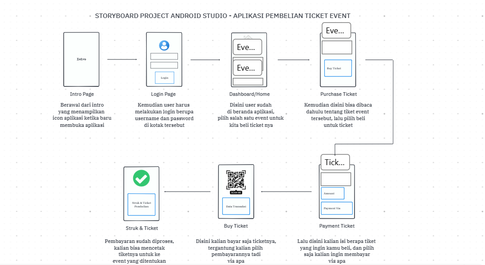
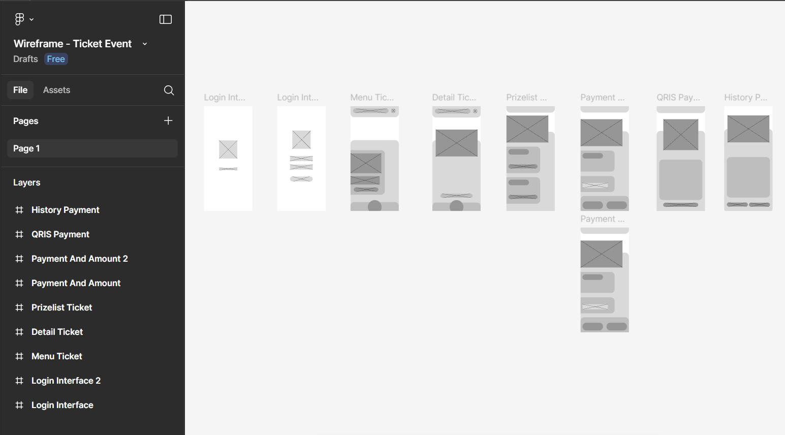
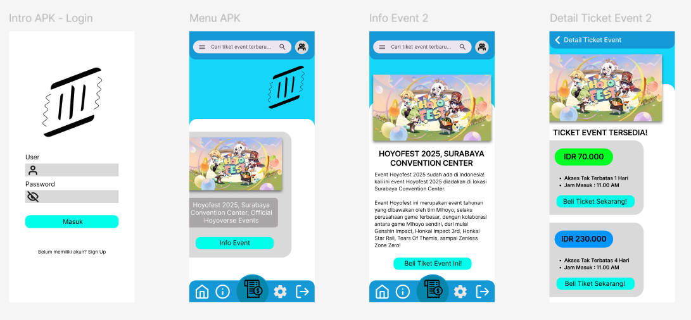

# AplikasiPembelianTicketEvent 
Nama : Ahmad Rizky Pramudia Pratama
NIM : 312410272
Kelas : TI.24.A4

Ini adalah deskripsi serta foto progress dari pembuatan aplikasi pembelian ticket event

Berikut merupakan timeline di clickup untuk progress pembuatan aplikasi pembelian ticket event

Kemudian disini ada storyboard

Dan setelah dibuatnya storyboard, baru dibuat wireframe 

Selanjutnya disini ada mockup serta UI/UX Prototype video nya

